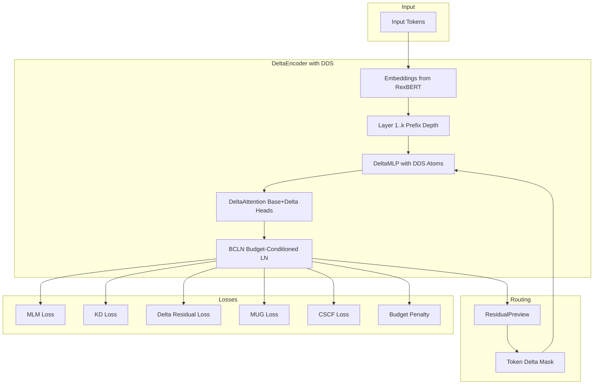

# Delta-Matryoshka++ for Text Encoders

A training recipe for **nested sub-models** with **delta residual corrections**, **prefix depth dropout**, **Delta Dictionary Sharing (DDS)**, and **token-conditional routing**.

> **One run -> many sub-models.** Train a single Transformer encoder whose nested variants (smaller width, fewer heads, fewer layers) work well by design.



## Features

- **Hierarchical Initialization**: Build mini -> base -> large with shared base slices
- **E-comniverse Dataset**: Streaming support for large-scale e-commerce MLM training
- **Delta Dictionary Sharing (DDS)**: Compact upgrade packs via shared low-rank atoms
- **Three-Phase Training**: Packing -> Residualization -> Calibration
- **Prefix Depth Dropout**: Pack information into early layers with survival scheduling
- **Token-Conditional Delta Compute**: Spend delta compute only where it helps
- **Monotonic Upgrade Guarantee (MUG)**: Larger budgets never degrade performance
- **Cross-Scale Feature Alignment (CSCF)**: Reduce representation drift across scales

## Hierarchical Model Architecture

Build larger models on top of smaller pretrained models:

```
┌─────────────────────────────────────────────────────────────┐
│                    RexBERT-large (400M)                     │
│  ┌───────────────────────────────────────────────────────┐  │
│  │                 RexBERT-base (150M)                   │  │
│  │  ┌─────────────────────────────────────────────────┐  │  │
│  │  │              RexBERT-mini (68M)                 │  │  │
│  │  │         (Core base - always executed)          │  │  │
│  │  └─────────────────────────────────────────────────┘  │  │
│  │           + Delta layers 7-12, heads, channels        │  │
│  └───────────────────────────────────────────────────────┘  │
│                + Delta layers 13-24, heads, channels        │
└─────────────────────────────────────────────────────────────┘
```

| Model | Params | Layers | Hidden | Heads | Intermediate |
|-------|--------|--------|--------|-------|--------------|
| mini  | 68M    | 6      | 384    | 6     | 1536         |
| base  | 150M   | 12     | 768    | 12    | 3072         |
| large | 400M   | 24     | 1024   | 16    | 4096         |

## Quick Start

```bash
# 1) Install dependencies
pip install -U torch transformers datasets accelerate

# 2) Train with RexBERT-mini as base, targeting RexBERT-base size
python -m src.train_mlm \
    --dataset_name thebajajra/Ecom-niverse \
    --tokenizer thebajajra/RexBERT-base \
    --base_model_path thebajajra/RexBERT-mini \
    --target_model_path thebajajra/RexBERT-base \
    --output_dir ./ckpts \
    --train_steps 100000 \
    --batch_size 64 \
    --lr 2e-4 \
    --hidden_size 768 \
    --num_hidden_layers 12 \
    --num_attention_heads 12 \
    --intermediate_size 3072 \
    --width_budgets 0.5 0.75 1.0 \
    --head_budgets 6 9 12 \
    --depth_budgets 6 9 12 \
    --enable_dds --dds_num_atoms 16 --dds_rank 64 \
    --enable_three_phase \
    --enable_cscf --tap_layers 4 8 11 \
    --enable_kd --enable_mug --enable_delta_depth \
    --enable_token_delta \
    --fp16

# 3) Or train mini->large directly
python -m src.train_mlm \
    --base_model_path thebajajra/RexBERT-mini \
    --target_model_path thebajajra/RexBERT-large \
    --init_delta_from_target \
    --hidden_size 1024 \
    --num_hidden_layers 24 \
    --num_attention_heads 16 \
    --intermediate_size 4096 \
    ...
```

## Project Structure

```
src/
├── __init__.py          # Package exports
├── model.py             # DeltaEncoder with DDS integration
├── dds.py               # Delta Dictionary Sharing module
├── weight_init.py       # RexBERT weight initialization
├── losses.py            # MLM, KD, MUG, CSCF, budget penalty losses
├── routing.py           # Token-conditional delta routing
├── droppath.py          # Stochastic depth with survival schedule
├── scheduler.py         # Three-phase training scheduler
├── train_mlm.py         # Main training script
└── eval_metrics.py      # AUTC, monotonicity, calibration metrics
```

## Data Preprocessing (Recommended)

For faster training, pretokenize and pack your dataset:

```bash
# Pretokenize and pack E-comniverse dataset (512 = standard length)
python -m src.data_utils \
    --dataset thebajajra/Ecom-niverse \
    --output ./data/ecomniverse_packed \
    --tokenizer thebajajra/RexBERT-base \
    --max_length 512 \
    --num_proc 8

# For longer e-commerce texts, use extended context (1024)
python -m src.data_utils \
    --dataset thebajajra/Ecom-niverse \
    --output ./data/ecomniverse_packed_1024 \
    --tokenizer thebajajra/RexBERT-base \
    --max_length 1024 \
    --num_proc 8

# Then train with pretokenized data (much faster!)
python -m src.train_mlm \
    --pretokenized_path ./data/ecomniverse_packed/train_packed.pt \
    --tokenizer thebajajra/RexBERT-base \
    --max_length 512 \
    ...
```

**Sequence length options:**
| Length | Use Case | Speed |
|--------|----------|-------|
| 128 | Quick experiments, short texts | Fastest |
| 512 | Standard BERT/RexBERT (recommended) | Fast |
| 1024 | Long product descriptions | Medium |
| 2048 | Maximum extended context | Slow |

**Benefits of pretokenization + packing:**
- **3-5x faster training** - no tokenization overhead
- **~2-3x more efficient** - packing reduces padding waste
- **Reproducible** - same data each run

**Packing example:**
```
Before packing (lots of padding):
  Seq 1: [CLS] Hello world [SEP] [PAD] [PAD] [PAD] ... (512 tokens, 90% padding)
  Seq 2: [CLS] Short text [SEP] [PAD] [PAD] [PAD] ...

After packing (minimal padding):
  Packed: [CLS] Hello world [SEP] Short text [SEP] Another doc [SEP] ... [PAD]
```

## Three-Phase Training

| Phase | Steps | Focus | Key Settings |
|-------|-------|-------|--------------|
| **1. Packing** | 0-33% | Pack information into prefix (base) | High depth dropout (α=0.5), oversample b_min |
| **2. Residualization** | 33-66% | Learn delta corrections + routing | Enable TCE, raise β_delta, anneal dropout |
| **3. Calibration** | 66-100% | Monotonicity + fine-tuning | Enable MUG, CSCF, low LR |

## Budgets

Each sub-model is defined by a budget `(w, h, d)`:
- **Width `w`**: Fraction of MLP channels (0.5, 0.75, 1.0)
- **Heads `h`**: Number of attention heads (4, 8, 12)
- **Depth `d`**: Number of transformer layers (4, 8, 12)

## Delta Dictionary Sharing (DDS)

Instead of storing full delta weight matrices, DDS uses:
- **Shared atom bank**: Low-rank matrices shared across all layers
- **Per-layer coefficients**: Tiny mixing weights (~96 floats/layer)

This enables **upgrade packs** of only a few KB for deploying enhanced models!

```python
# Export DDS upgrade pack
model.export_delta_pack()  # Returns compact coefficient dict
```

## Exporting to HuggingFace Format

Export trained models to HuggingFace-compatible format for easy deployment:

```bash
# Export single budget as HF model
python -m src.export_hf \
    --checkpoint ./ckpts/best.pt \
    --budget 0.5:6:6 \
    --output ./hf_exports/mini \
    --tokenizer thebajajra/RexBERT-base

# Export multiple budgets
python -m src.export_hf \
    --checkpoint ./ckpts/best.pt \
    --budgets 0.5:6:6 0.75:9:9 1.0:12:12 \
    --output ./hf_exports \
    --tokenizer thebajajra/RexBERT-base
```

### Load with HuggingFace

```python
from transformers import AutoModel, AutoTokenizer

# Load exported model with standard HF API
model = AutoModel.from_pretrained("./hf_exports/mini", trust_remote_code=True)
tokenizer = AutoTokenizer.from_pretrained("./hf_exports/mini")

# Use as normal HF model
inputs = tokenizer("Hello world!", return_tensors="pt")
outputs = model(**inputs)
embeddings = outputs.last_hidden_state
```

### Push to HuggingFace Hub

```python
from transformers import AutoModel, AutoTokenizer

model = AutoModel.from_pretrained("./hf_exports/mini", trust_remote_code=True)
tokenizer = AutoTokenizer.from_pretrained("./hf_exports/mini")

# Push to Hub
model.push_to_hub("your-username/delta-matryoshka-mini")
tokenizer.push_to_hub("your-username/delta-matryoshka-mini")
```

### Legacy Export (PyTorch only)

```bash
python -m src.train_mlm --export_only \
    --load_path ./ckpts/best.pt \
    --export_budgets 0.5:4:6 0.75:8:8 1.0:12:12 \
    --output_dir ./exports
```

## Evaluation Metrics

The evaluation suite tracks:
- **MLM Perplexity** per budget configuration
- **AUTC** (Area Under Trade-off Curve): Accuracy vs FLOPs
- **Monotonicity Violations**: Cases where larger budgets underperform
- **Delta Pack Size**: Bytes for DDS coefficients
- **ECE/NLL**: Calibration metrics across sub-models

```python
from src import run_full_evaluation, Budget

results = run_full_evaluation(
    model, eval_loader,
    budgets=[(0.5, 4, 4), (0.75, 8, 8), (1.0, 12, 12)],
    device=device
)
print(results["summary"])
```

## Configuration

See `ablations.yaml` for all hyperparameter settings. Key knobs:

```yaml
model:
  base_ratio: 0.5        # MLP channels in base slice
  base_heads: 6          # Attention heads in base slice
  drop_path: 0.2         # Stochastic depth rate
  budget_cond_ln: true   # Budget-aware LayerNorm

train:
  enable_dds: true       # Delta Dictionary Sharing
  dds_num_atoms: 16      # Number of shared atoms
  dds_rank: 64           # Rank of each atom

loss:
  alpha_kd: 1.0          # KD weight
  beta_delta: 0.7        # Delta residualization weight
  rho_mug: 0.1           # Monotonic upgrade weight
  zeta_cscf: 0.1         # Feature alignment weight
```

## License

Apache-2.0
